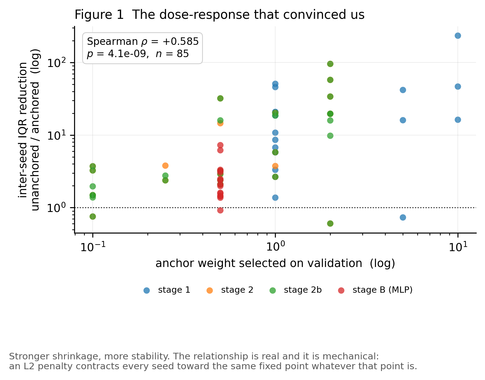
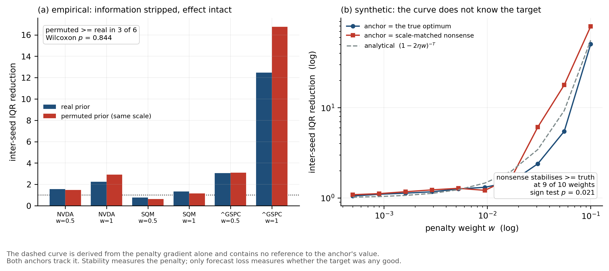

# Four Findings That Dissolved: A Pre-Registered Audit of a Value-at-Risk Study

**Draft v1** — G5. Every number is read from a result file — `outputs/paper_figures.json`
(derived from the result CSVs and the test-touch ledger), `outputs/bootstrap_intervals.json`,
and `outputs/contraction_check/`. None is typed by hand, and
`scripts/refresh_paper_figures.py --check` fails if any summary drifts from its source.

---

## Abstract

A statistically convincing result can be produced by the fitting procedure rather than by the
data, and no amount of additional statistical testing will detect this. We document four
instances in a single pre-registered study, using as a vehicle the question of whether anchoring
a quantile-loss model to a classical Value-at-Risk prior improves one-day-ahead forecasts. It
does not; that answer is not the contribution. Over eight assets and two quantile levels the
study produced four findings, each apparently well supported, and **all four were subsequently
withdrawn**. One fell to a multiplicity correction, one to a power analysis, one to a check of
the model's own seed noise — three familiar failures. The fourth was the strongest result in the
project, replicated across four runs with a dose–response relationship and a sign test at
$p = 5.2 \times 10^{-4}$, and **it survived every statistical control available**. It dissolved when asked
whether the mechanism guaranteed it, at a cost of 28 minutes of validation compute and no test
data at all.

We disclose **1,959 test-set evaluations across 16 asset–level cells and four scoring passes**,
with **zero cells scored only once**, and we reproduce the decisive artefact synthetically with
ground truth known: across a ten-point weight grid an anchor carrying **no information**
stabilises the estimator **at least as much as the true optimum at 9 of 10 weights**
(sign test $p = 0.021$) while forecasting materially worse. **The two controls that destroyed the
two surviving findings — a power calculation and a scale-matched permutation — were also the two
cheapest, and a five-paper survey coded against a pre-fixed schema finds neither in use.** None
of these failures required anyone to behave badly, which is the paper's argument.

---

## 1. Introduction

Machine-learning papers increasingly report statistically significant improvements over
classical baselines, supported by careful evaluation protocols and small p-values. Comparatively
little attention is paid to a different possibility: that a statistically convincing finding can
arise from a mechanical property of the fitting procedure itself, and that no amount of
additional statistical testing will reveal this, because the mechanism guarantees the result
before any data is seen.

This paper is a record of that happening four times in a single pre-registered study.

**The failures documented here were not produced by bad practice.** None involves fabrication,
p-hacking, or a protocol anyone would defend as unusual. Each arose inside a design that was
pre-registered in advance precisely in order to be careful, and each survived the controls that
design specified. That is what makes them worth reporting. A study that fails because its
authors cut corners teaches nothing; a study that fails while following the rules identifies a
gap in the rules.

### 1.1 Where this paper came from

No one set out to write it. It began as an ordinary applied project with an ordinary ambition:
show that anchoring a neural quantile model to a classical VaR prior beats the unanchored model.
The intended paper was the one that gets written thousands of times a year — *our method wins,
here is the table.*

The starting state is worth describing precisely, because it is unremarkable and that is the
point:

- The method was called a **physics-informed neural network**. It was not. No monotonicity or
  sub-additivity constraint was ever implemented; the mechanism was an L2 penalty toward a
  rolling parametric prior. The name came from the family of ideas the work was inspired by,
  and it survived because nothing in the workflow required anyone to check it against the code.
  **The paper's own title was wrong before any result was.**
- Hyper-parameters were chosen by running the pipeline and looking at the output. There was no
  validation block, so they were selected on the test set.
- Each configuration ran on **one seed**.
- Models were ranked on breach counts and "capital reserved" rather than on a strictly
  consistent loss.
- The GARCH benchmark carried a standardized-*t* scaling error that inflated its VaR by
  $\nu/(\nu-2)$ — that is, **the baseline we were beating was handicapped** (§5).

Every item on that list is a decision someone made while trying to do good work, and none would
have been caught by peer review of the resulting manuscript, because none is visible in a
manuscript. Fixing them was not a matter of discovering misconduct. It was a matter of a
protocol asking questions the original workflow had no place to put.

What followed is the substance of this paper: each correction moved the result toward the null,
and after four of them there was no result left. The four withdrawals below are not a catalogue
of things other researchers do wrong. **They are what one careful project looked like when it was
finally instrumented well enough to see itself.**

### 1.2 Setting and scope

**The vehicle is a Value-at-Risk study**, chosen because it is a domain with well-established
baselines, a strictly consistent scoring function, and standard backtests — an unusually
favourable setting for detecting a spurious result. The question was narrow: does an L2 penalty
anchoring a quantile-loss model to a classical VaR prior improve one-day-ahead forecasts? The
answer is no. That answer is not the contribution, and readers interested in VaR modelling
specifically will find §8 disappointing by design.

A survey of **five** machine-learning VaR papers, each read in full and coded against a schema
fixed before any paper was read (Appendix D), locates the gap more precisely. Practice in this
literature is **heterogeneous, and no paper in the sample is careless** — two use a held-out
selection block, one selects on a strictly consistent loss, one corrects for multiplicity and
then explicitly downgrades its own p-values, and all five gate on coverage.

Across all five, however: **test-set reuse is never counted, no power analysis appears, and none
is pre-registered.** The controls this field has institutionalised are not the controls that
defeated this study. A convenience sample of five cannot establish a base rate and we do not
claim it does; by the standard §3.2 applies to our own nulls, it is an illustration.

**Contributions.**

1. A pre-registered VaR study reporting a complete null, with dated amendments including
   several that weakened the authors' own position. Pre-registration remains rare in this
   domain: as of July 2023 **≤ 1% of economics journals** had adopted the registered-report
   format (Lin et al. 2024).
2. **Four failure modes observed in a single pre-registered study**, with the control that
   detects each and its cost. We claim instances, not coverage: one study cannot establish a
   taxonomy and we do not present one.
3. A demonstration — analytical and synthetic, with ground truth known — that
   **shrinkage-induced stability is not evidence of a good prior**, together with a
   scale-matched permutation control that separates the two for minutes of compute.
   **Neither the mechanism nor the control is new**: the mechanism is Stein/ridge shrinkage,
   and the control is a restricted randomization test with precedents in statistics, machine
   learning and econometrics (§3.5). What we document is that the artefact is *reportable as an
   empirical finding*, survives a pre-registered protocol with a dose–response and
   $p = 5.2 \times 10^{-4}$ — and that we located no prior application of the control to a stability claim.
4. *(Software artefact, Appendix A.)* An append-only **test-touch ledger** that makes
   evaluation reuse countable rather than reconstructible after the fact.

## 2. Setup

**Question.** Does an L2 penalty pulling a quantile forecast toward a classical VaR prior
(rolling Normal `mu - z*sigma`, or rolling historical quantile) improve out-of-sample pinball
loss relative to the identical unanchored model?

**The estimator nests its own baseline.** The anchor weight grid includes zero, so the anchored
specification *contains* the unanchored one. It therefore cannot be worse by construction; it
can only lose through validation-selection error. This turns out to matter (§3.2).

**Data.** Eight instruments spanning equity index, single names, crypto, metals, energy and FX.
Ten-year frozen snapshots with sha256 manifests, verified on every load. Daily log returns.

**Protocol.** Chronological TRAIN / VAL / TEST; monthly refit on an expanding window with warm
start; ≥ 10 seeds per specification reported as median and IQR; pinball loss for ranking;
Kupiec and Christoffersen as a coverage gate; Diebold–Mariano with HAC errors for pairs;
Hansen's Model Confidence Set across the ladder.

**Primary evidence set.** Only two cells had ever been scored before the main panel
(`^GSPC` at both levels and `BTC-USD` at α = 0.05, during debugging). Excluding them leaves
**13 cells, 7 tickers, 26 comparisons** of genuine first contact. The exclusion criterion is
file timestamps, independent of any result; the check in §6 shows that it moves both headline
numbers *against* the study's own thesis.

## 3. Four findings and their withdrawals

The four withdrawals are not equivalent, and presenting them as a flat list would obscure the
one that matters.

**The first three are familiar.** Multiplicity, insufficient power, and effects smaller than the
estimator's own noise are textbook failure modes; each has a named remedy, each remedy is
uncontroversial, and a sufficiently careful referee would ask for all three. They are reported
here because they occurred *despite* pre-registration, and because their costs are worth
tabulating — but a reader who knows the literature will find nothing structurally new in §3.1
to §3.3. They are the price of admission.

**The fourth is not.** It is the only one where the finding survived every statistical control
available — multiplicity correction, dose–response, replication across four runs, a sign test at
$p = 5.2 \times 10^{-4}$ — and dissolved only when asked a question that is not statistical at all: *does the
mechanism guarantee this result regardless of whether the hypothesis is true?* §3.4 and §3.5 are
the substance of the paper; §3.1 to §3.3 establish that the study was careful enough for §3.4 to
be surprising.

### 3.1 "Anchoring improves out-of-sample loss" — multiplicity

Three of 26 comparisons reject at 5% uncorrected. **One survives Holm.** More seriously, by the
time we reported this the test block had been scored four times, so no comparison retains
out-of-sample status.

*Control: a multiplicity correction and a count of test-set passes. Cost: free.*

### 3.2 "Weight selection is indistinguishable from chance" — power

Of 16 comparisons where validation selected a non-zero weight, **6 (37.5%) were worse than
`w = 0`** on the evaluation block. Binomial $p = 0.45$ against a coin flip; 95% CI
[0.15, 0.65]. We initially reported this as evidence that the selection signal is noise.

It is not. At n = 16 the design detects a proportion only below **0.147** or above **0.853**.
Power against the observed effect is **9.5%**. Reaching 80% power would need **125
comparisons**. A selection procedure with a genuinely useful 30% error rate would have been
missed 91% of the time.

The correct statement is *undetermined*, not *chance*. We also retract our earlier framing of
four configurations as independent replications: they share assets and periods.

**And "undetermined" is still not the whole answer.** Cawley and Talbot (2010) established that
a model-selection criterion is itself an estimator with a variance, and that optimising it over
a finite sample **over-fits the criterion** exactly as training over-fits the data. Two of their
findings apply directly:

- They deliberately construct *"a split-sample based model selection strategy with a relatively
  high variance, **due to the limited size of the validation set**"* — which is our design, not
  a pathological case. Enlarging the validation block tightens the selected hyper-parameter
  around the optimum; ours was fixed and short.
- More seriously: *"the effects of this form of over-fitting are often of **comparable magnitude
  to differences in performance between learning algorithms**."* Our observed anchoring edges
  are 1–8% of the loss level. **If selection over-fitting operates at the same scale as the
  effect being measured, the comparison was conducted inside the noise floor of its own
  selection step** — a stronger and more specific statement than "underpowered."

They also observe that the criterion surface is often *"a broad valley,"* so a badly chosen
hyper-parameter can still generalise adequately. That is a better account of our 37.5% than the
one we first gave: not that selection carries no signal, but that the surface is flat and the
block is short.

Their prescribed remedy — *"evaluation … should always involve multiple partitions of the data
to form training/validation and test sets"* — is only partly available here, because the data
are time series and shuffling would leak. The available version is multiple **chronological**
origins. We did not run them. That is a limitation, not a defence.

*Control: a power calculation. Cost: free. Never performed until a reviewer demanded it.
The relevant literature is from 2010 and we did not read it until after the result.*

### 3.3 "Higher capacity hurts accuracy" — the model's own noise

An 8,641-parameter MLP lost to a 4-parameter linear model in 4 of 5 assets. **Zero of the five
gaps exceed the combined inter-seed IQR of the two models being compared.** The MLP also
inherited its learning rate and epoch budget from the linear model and was never tuned;
convergence was not recorded and so is unfalsifiable.

*Control: compare effect sizes to the models' own seed dispersion. Cost: free.*

### 3.4 "Anchoring stabilises the estimator" — tautology

This was the strongest result in the project. Across four runs the anchored estimator had lower
inter-seed IQR in 19/20, 21/23, 25/27 and **15/16** comparisons (primary set: $p = 5.2 \times 10^{-4}$,
median ratio **13.5x, 95% CI 4.6–20.7**, n = 16), with a clean dose–response between the
selected weight and the effect:
**Spearman ρ = +0.585, $p = 4.1 \times 10^{-9}$, n = 85**.



**Figure 1 is reproduced because we ourselves found it persuasive.** It is the evidence that
convinced us, pooled across all four runs, and it is an artefact. Its apparent strength
illustrates how easily this failure mode survives conventional statistical scrutiny — which is
the difficulty the rest of the section is about.

An L2 penalty pulls every seed toward the *same fixed target*. As the weight grows all seeds
converge on that target and inter-seed dispersion goes to zero **by construction** — whatever
the target is. The dose–response we took as corroboration is the signature of the artefact.

**The control.** Re-run with the real prior **permuted in time**: identical mean, standard
deviation and marginal distribution; correlation with tomorrow's absolute return 0.0007 versus
0.041. Matched on magnitude, stripped of information.

| ticker | weight | real prior | shuffled prior |
|---|---|---|---|
| NVDA | 0.5 | 1.55× | 1.49× |
| NVDA | 1.0 | 2.25× | **2.91×** |
| SQM | 0.5 | 0.76× | 0.63× |
| SQM | 1.0 | 1.33× | 1.15× |
| ^GSPC | 0.5 | 3.05× | **3.10×** |
| ^GSPC | 1.0 | 12.47× | **16.76×** |

The uninformative prior matches or beats the real one in 3 of 6 cells; **Wilcoxon $p = 0.844$**.
Bootstrapped over comparisons, the two are indistinguishable: real prior **1.9x (95% CI
1.0–7.8)** against shuffled **2.2x (95% CI 0.9–9.9)**. The intervals overlap almost entirely,
which is a more informative statement of the null than the rank test alone.

*Control: shrink toward a scale-matched nonsense target. Cost: 28 minutes, validation only,
zero test-set evaluations.*

**A trap.** Pooling all controls gives 1.32× against 2.36× for informative priors, which looks
like a genuine gap. It is produced entirely by a control shrinking toward an off-scale target,
which fights the data rather than shrinking within it. Only the **scale-matched** comparison is
diagnostic, and it is null. Reporting the aggregate would have preserved the claim.

**This is a restricted randomization test, and we should have known that before running it.**
The requirement we arrived at by tripping over the trap above — that the permuted target must
preserve the properties irrelevant to the hypothesis and destroy only the one under test — is
stated directly by Ojala and Garriga (2010), whose second permutation test permutes features
within classes for exactly this reason: *each randomization method entails a certain null
distribution, that is, which properties of the original data are preserved.* An off-scale
control induces a different null and is therefore not diagnostic. We report the sequence
honestly — we found the constraint empirically and located its name afterwards — because the
control is more credible with a seventy-year lineage (Fisher 1935; Pitman 1937) than as an
invention of ours.

### 3.5 The artefact isolated: a synthetic demonstration

One case does not establish that the artefact is general. It is therefore reproduced where the
ground truth is known and nothing is estimated from markets.

**Setup.** Let $y = X\beta + \varepsilon$ with $\varepsilon \sim \mathcal{N}(0,1)$, so the
optimal linear $\alpha$-quantile is exactly $X\beta + z_\alpha$ and is available in closed form.
We fit by descending

$$\mathcal{L}(\theta) \;=\; \mathrm{pinball}_\alpha(y - X\theta) \;+\; w\,\lVert \theta - a \rVert^2$$

from random initialisations under a **finite step budget** — the condition that produces seed
dispersion in the first place, and the condition the real study was under via early stopping.
Three anchors $a$: the **true** optimum; a **scale-matched nonsense** vector with identical norm
pointing elsewhere; and zero.

**Analytically.** The penalty's gradient is $2w(\theta - a)$. Writing $\theta_t$ and
$\theta'_t$ for two runs that differ only in initialisation, and $\Delta_t = \theta_t -
\theta'_t$ for their separation, one gradient step gives

$$\Delta_{t+1} \;=\; \underbrace{(1 - 2\eta w)\,\Delta_t}_{\text{penalty}} \;-\; \underbrace{\eta\left[g(\theta_t) - g(\theta'_t)\right]}_{\text{data term}},$$

where $g$ is the pinball subgradient and $\eta$ the step size. **The anchor cancels exactly in
the first term**, since $(\theta_t - a) - (\theta'_t - a) = \Delta_t$. Dropping the second term
leaves

$$\lVert \Delta_T \rVert \;\approx\; \lVert \Delta_0 \rVert \,(1 - 2\eta w)^T .$$

This depends on $w$, $\eta$ and $T$. **It contains no reference to $a$.** Shrinking toward the
truth and shrinking toward nonsense contract inter-seed dispersion by the same factor, to the
accuracy measured below.

> **The finite-budget condition is not incidental, and the result is false without it.** The
> objective is convex, so as $T \to \infty$ every initialisation converges to the same optimum
> and inter-seed dispersion goes to zero for *any* $w$, including $w = 0$. The expression above
> describes the **pre-convergence regime**: a finite step budget, or equivalently early
> stopping. That regime is not a contrivance of the demonstration — it is the regime the real
> study operated in, because its stopping rule halted training before convergence (§5, defect 1).

**The approximation is measured, not assumed.** The step above drops
$\eta[g(\theta_t) - g(\theta'_t)]$, and an earlier version of this paper asserted without
checking that the remainder was negligible — the practice this paper exists to criticise, in its
own central derivation. Tracking the true separation trajectory
$\lVert \Delta_t \rVert$ against the formula (`scripts/measure_contraction.py`) gives:

| quantity | result |
|---|---|
| contraction from the dropped term alone, at $w = 0$ | $14\times$ — the formula predicts none |
| absolute prediction, observed $/$ predicted | median $0.070$ — low by $\approx 14\times$ |
| **prediction of contraction relative to $w = 0$** | median $1.05$, range $[0.80,\, 1.11]$ |

**The raw formula is a poor predictor of absolute spread and a good predictor of the quantity
this paper actually reports.** The reason is visible in the derivation. Writing $S(w)$ for the
observed contraction and $P(w) = (1-2\eta w)^T$ for the prediction, the dropped term contributes
an approximately weight-independent factor $c$, so that $S(w) \approx c\,P(w)$. Every figure in
this paper is a **ratio against the unanchored baseline**,

$$\frac{S(0)}{S(w)} \;\approx\; \frac{c\,P(0)}{c\,P(w)} \;=\; \frac{1}{(1-2\eta w)^T},$$

and $c$ cancels. The absolute error of $\approx 14\times$ and the relative accuracy of $5\%$ are
therefore the same fact seen twice: the formula misses a constant, and the reported quantity does
not depend on it. An IQR ratio is exactly such a quantity.

The same measurement corrected a second claim. The cancellation of $a$ is exact **for the penalty
term**, but the anchor still moves each iterate individually and therefore alters the dropped
subgradient difference — it re-enters implicitly. Measured, the two anchors agree to within
**3.4% for $w \leq 0.017$** and diverge to **50% at $w = 0.1$**. The honest statement is
**anchor-independent to first order, with a second-order dependence that grows with the weight**.
This does not rescue the informative prior: at $w = 0.1$ the anchors differ by 50% while the
contraction itself is 44–56$\times$, and the residual runs the *wrong* way — the nonsense anchor
contracts the parameter separation slightly less.

**Numerically**, over a ten-point log-spaced weight grid with 40 seeds per cell
(pure numpy, 22 seconds):

| weight | truth | nonsense | nonsense ÷ truth |
|---|---|---|---|
| 0.0005 | 1.05× | 1.09× | 1.03 |
| 0.0009 | 1.10× | 1.12× | 1.02 |
| 0.0016 | 1.13× | 1.17× | 1.04 |
| 0.0029 | 1.17× | 1.23× | 1.05 |
| 0.0053 | 1.26× | 1.28× | 1.02 |
| 0.0095 | 1.31× | 1.21× | **0.93** |
| 0.0171 | 1.51× | 1.67× | 1.11 |
| 0.0308 | 2.39× | 6.09× | 2.55 |
| 0.0555 | 5.46× | 17.81× | 3.26 |
| 0.1000 | 50.40× | 79.23× | 1.57 |

**Paired at each weight**, the uninformative anchor stabilises **at least as much as the true
optimum at 9 of 10 weights** (sign test **$p = 0.021$**), with a median relative ratio of
**1.04 (95% CI 1.0–1.8)**. The dose–response is emphatic and holds for every anchor
(Spearman ρ = **+0.974**, $p = 1.3 \times 10^{-19}$, n = 30), reproducing the pattern we had taken as
corroboration in the real study (ρ = +0.585).

Loss moves the other way: the true anchor improves out-of-sample loss, the nonsense anchor
degrades it. **Stability tracks the penalty; usefulness tracks the target. They are different
axes, and only the second is evidence.**



**Figure 2 is Figure 1 with a control.** Panel (a) repeats the empirical comparison against a
prior permuted in time; the effect is unchanged. Panel (b) overlays the analytical contraction
`(1 − 2ηw)^−T` — a curve derived from the penalty gradient alone, which contains no reference to
the anchor's value. Both the true and the nonsense anchor track it. The dashed line is the whole
argument: it predicts the data without knowing what the data was shrunk toward.

> **This section was itself corrected twice, and both corrections are reported in Appendix B.**
> An earlier version ran four weights and quoted the single most extreme cell; and the file this
> draft reads its numbers from was later found to be stale, still holding the retracted values.
> Neither changes the conclusion; both are the practice §3.1 criticises, committed in our own
> showcase.

**The paired column above is the paper's central point.** Stability rises with the penalty for
any target; usefulness depends on the target being right. A study that reports the first as
evidence for the second has reported an identity.

**Generalisation.** For any regularised estimator, stability under a shrinkage penalty is not
evidence that the shrinkage target is good. The mechanism is Stein/ridge shrinkage and is not
itself new; what we document is that it is **reportable as an empirical finding**, that it
survives a pre-registered protocol with a dose–response and $p = 5.2 \times 10^{-4}$, and that a
scale-matched permuted control detects it for minutes of compute.

**Nothing about that control is ours.** It is a restricted randomization test (Fisher 1935;
Pitman 1937; Ojala & Garriga 2010), and the move it makes — randomize the input a claim depends
on and check whether the claim survives — is the move behind the random-label experiment of
Zhang et al. (2017), the model- and data-randomization sanity checks of Adebayo et al. (2018),
and the placebo laws of Bertrand, Duflo and Mullainathan (2004), who found conventional
difference-in-differences standard errors significant at 5% for up to 45% of interventions that
never happened. Four literatures already treat this as routine.

What we could not find is an instance applied to a **stability** claim rather than an accuracy
or treatment-effect claim. We state that as a search null and not as a gap: by the standard §3.2
applies to this study's own nulls, failing to find something is not evidence it is absent. We
offer §3.4 as a template, not as a method — and the appropriate conclusion is that a control
already standard in four fields should be applied in a fifth, which is a much weaker and much
more defensible claim than novelty.

**And the practice we set out to criticise turns out to be handled correctly where it
originates.** We expected to find regularisers proposed as remedies for run-to-run variance with
the resulting stability offered as evidence of quality. The first half is true: Bhojanapalli et
al. (2021) propose exactly such regularisers. The second half is false — they report accuracy
beside stability throughout, include a deterministic zero-variance control, and state our own
§3.5 point in prose (Appendix D).

We report this because it weakens the section, and because it sharpens it. **Our error was not
reporting stability; it was inferring from stability a conclusion about the target.** Where
reduced run-to-run variance *is* the objective, reporting it is correct. We instead used it as
evidence that the anchor carried risk information — a claim about the target that no property of
the penalty can support.

The failure is therefore not a field's carelessness but what happens when a concept crosses
domains and its controls do not travel with it. The one documented instance of the inference
being made explicitly is a VaR paper (Petneházi 2019), offering *"consistently lower standard
deviation than the benchmark methods… which also justifies that this one produces the highest
quality VaR estimates"* with no matched control. We made the same move, in the same domain, four
years later.

**Every magnitude above carries a bootstrap interval.** The resampling unit is the
*comparison*, because the quantity quoted is a median across comparisons. A seed-level interval
would answer a different question and requires the per-seed losses, which our pipeline did not
originally persist — a gap we found only when trying to satisfy this requirement, and have since
closed. **The intervals are wide.** That is itself part of the finding: the magnitudes this
study reported were never as precise as a bare point estimate implies.

## 4. Disclosure

From the append-only ledger, not a hand count:

| quantity | value |
|---|---|
| test-set evaluations | **1,959** |
| asset–level cells | 16 |
| maximum scoring passes on one cell | **4** |
| cells scored exactly once | **0** |

Design choices between passes — weight grid, selection rule, architecture, asset subset — were
informed by the previous pass's outcomes. Per our own protocol the honest description is that
this project has several validation blocks and **no test set**.

The ledger figure exceeds the 1,899 first reconstructed from run manifests: **60 evaluations
appear in no manifest at all**, and were found only because the ledger was built (Appendix A).

## 5. Three defects, all in the same direction

This section is not a confession, and should not be read as one. Each defect below is the kind
that a competent implementation produces and a code review passes: a plausible convergence rule,
a NaN-handling choice, an unguarded edge case. What is worth attention is not that they occurred
but *where they were found* — all three surfaced when an unrelated check failed, none when a
result that looked correct was audited.

1. **Early stopping.** The rule halted when consecutive epochs changed by < 1e-6. Pinball loss
   on a linear model is piecewise linear and plateaus; the L2 anchor makes the objective smooth.
   The anchored model trained roughly 42× more epochs per block. *The anchor bought training,
   not information.*
2. **Unequal training rows.** Rows with an undefined prior were dropped only when an anchor was
   active, giving `w = 0` about 252 extra rows. The weight grid was not comparing like with like.
3. **A Diebold–Mariano exception** on identical forecasts crashed 8 of 16 cells — exactly those
   where validation had switched the anchor *off*, the most informative outcome available.

Each defect, before correction, favoured the hypothesis under test.

**We must be careful here, because this is exactly the kind of claim this paper is about.**
Three of three in the same direction is **$p = 0.125$** one-sided under independent signs. By our
own standard in §3.2 — where 6/16 at $p = 0.45$ was ruled insufficient — n = 3 cannot support a
conclusion, and we do not draw one.

What we offer instead is a mechanism worth testing by someone with a larger sample: *a defect
that contradicts your hypothesis gets investigated; one that confirms it gets shipped.* Each of
these three was found only because an unrelated check failed, not because anyone audited a
result that looked right. That asymmetry in scrutiny is measurable in principle — count, across
a corpus of projects, the direction of defects found before versus after publication — and we
suggest it be measured rather than asserted.

**A fourth class of defect appears in the bibliography.** Verifying all twenty citations stated
from standing knowledge found **five errors**, four of them inherited from other people's
descriptions of a source rather than from the source. One had the cited paper's argument
*backwards*, in the direction that would have supported us. **Appendix C** reports the audit;
the transferable claim is that the bibliography is part of the result, and checking it is an
experiment whose outcome you cannot predict.

## 6. Checks on this study's own analysis

The primary evidence set is a post-hoc subset, which invites the obvious objection. Its
selection criterion is mechanical (file timestamps) and result-independent, and it moves both
headline numbers *against* the hypothesis under test:

| | full stage 1 | first-touch subset | direction |
|---|---|---|---|
| selection error | 45% | **38%** | further from 50% — weakens "selection is noise" |
| seed-IQR reduction (median) | 16.1× | **13.5×** | smaller — weakens "the anchor stabilises" |

The table is reported so a reader can run the same check.

**Residual contamination.** The seven first-touch assets were never *scored* before, but the
code that scored them was revised after inspecting `^GSPC`'s output — that is how defects 1 and
2 were found. This is weaker than a pristine holdout and we say so rather than claiming
otherwise.

## 7. The taxonomy

| control | what it caught | cost |
|---|---|---|
| Golden tests on scoring conventions | sign-convention and coverage bugs | minutes |
| Multi-seed protocol | single-seed results were noise | small |
| Diebold–Mariano + Holm | 3 of 26 raw "wins" became 1 | free |
| Model Confidence Set | ladder inseparable at this n | free |
| Test-touch ledger | 1,959 evaluations, 4 passes, 60 uncounted | trivial |
| **Power analysis** | headline null had 9.5% power | **free** |
| **Nonsense-prior control** | strongest finding was arithmetic | **28 min** |
| **Citation verification** | 5 of 20 references wrong, one backwards | hours |

The two controls that destroyed the two surviving findings are also the two cheapest. Neither
appears in any of the four machine-learning VaR papers surveyed in §1 — including the one that
handles held-out selection, consistent scoring and ensembling properly.

Neither is exotic, either. Power analysis is standard in clinical trials and psychology;
permutation and placebo controls are standard in statistics, machine-learning
interpretability, and applied econometrics (§3.5). **The problem is not that these controls are
expensive or unknown. It is that each field's checklist was assembled to catch that field's
historical failures, and a mechanically guaranteed result is nobody's historical failure.**

## 8. Limitations

- Eight assets, two levels, one market regime; conclusions about VaR modelling do not follow
  and are not offered.
- No untouched holdout exists in this universe. All results are validation-grade.
- The capacity arm rests on an untuned network and is withdrawn, not resolved.
- **A single chronological TRAIN/VAL/TEST partition.** Cawley & Talbot (2010) recommend multiple
  partitions, since one partition may arbitrarily favour a given model. Shuffling is forbidden
  by the time-series structure, but multiple chronological origins were available and were not
  run. Every selection result here rests on one draw of one split.
- The nonsense-prior control was run on three assets at one level; it is decisive about
  mechanism, not about magnitude.
- We report a case study, not a survey. We do not claim these four failure modes are the most
  common ones, only that all four occurred in a single well-intentioned study.

## 9. Conclusion

We set out to test whether anchoring helps a quantile model forecast tail risk. It does not, in
our hands — but we cannot even claim that cleanly, because by the time we could ask the
question properly we had spent the test set four times over.

What we can offer is the record: four findings, four withdrawals, and the specific cheap check
that dissolved each. The most instructive is the last. A result replicated across four runs,
with a dose–response relationship and $p = 5.2 \times 10^{-4}$, was a restatement of the fact that shrinkage
shrinks.

Three of the four withdrawals came from statistical controls, and are unremarkable for that
reason. The fourth did not. **It was pre-registered, estimated over ten seeds, ranked on a
strictly consistent loss, tested with Diebold–Mariano, screened by the Model Confidence Set,
gated on coverage, replicated across four runs, and corroborated by a dose–response
relationship — and it survived all of it. It did not survive asking whether the mechanism itself
guaranteed the result.**

That question has no p-value attached and appears in no methods checklist. It costs one refit
against a target chosen to carry no information. Where a paper offers stability, robustness, or
reduced variance as evidence that a method is good, the question should be asked before the
statistics are, because no quantity of the latter will answer it.

**For the practitioner with a VaR model to ship on Monday**, the transferable step is one line
of work: before comparing losses, refit the model against a prior permuted in time — same mean,
same variance, same marginal distribution, no information — and check what your reported benefit
does. Whatever survives that is yours. Whatever does not was the penalty.

We began this project intending to publish a method. What we have instead is a control, and it
is not even ours (§3.5). That trade was not a bad one.

---

# Appendices

The appendices carry the audit trail. Nothing in them is required to follow the argument; they
exist so that a reader who wants to check a claim does not have to take our word for it, and so
that the body of the paper can make the argument without narrating every correction along the
way. **Appendix B and Appendix C each record errors we made and caught. They are placed here
rather than cut because a paper about verification that reported only its successes would be
making the mistake it documents.**

## Appendix A — The test-touch ledger

`src/value_at_risk/evaluation/ledger.py`. An append-only JSONL record; one line per scoring pass
over the test block, each carrying a sha256 fingerprint of the modules that determine what a
test score means. Cells can be declared *protected*; touching a protected cell that already has a
recorded touch raises rather than warns, so the single-pass rule is enforced in code rather than
in intention.

The disclosure integers in §4 are read from it (`python -m value_at_risk.evaluation.ledger
--summary`), never counted by hand. Building it revealed **60 evaluations present in no run
manifest** — two early debugging runs — which is the discrepancy an append-only record exists to
surface.

## Appendix B — Two corrections to our own demonstration

**B.1 — The cherry-picked cell.** §3.5 originally ran four weights and reported that the
worthless anchor *"stabilises 2.5× more"* than the true one. That figure was the largest of four
cells; a bootstrap interval at n = 4 is near-uninformative, saturating at the observed range.
The demonstration is pure numpy and runs in 22 seconds, so the grid was extended to ten points
and 40 seeds. The honest statement is *at least as much*, median relative ratio **1.04** — weaker
in magnitude, far stronger as evidence, because it is systematic rather than selected. Quoting
the most extreme cell is precisely the practice §3.1 criticises, and we did it in our own
showcase.

**B.2 — The stale source of truth, twice.** When the demonstration was rerun on the denser grid,
`outputs/paper_figures.json` — the file this paper's header promises every number is read from —
was not regenerated. It continued to hold the superseded four-weight values, **including the
exact pair (5.57× and 13.85×) whose quotient is the retracted 2.5×.** Any regeneration of the
manuscript from that file would have silently reinstated the figure the correction removed.

The prose was right and the machine-readable source was stale, which is the harder failure to
notice. It was caught by re-deriving every quoted figure from the result CSVs rather than
trusting the summary.

**The same defect was then found in a second file.** `outputs/bootstrap_intervals.json` had
likewise kept its synthetic entries at n = 4, with the retracted values sitting in the interval
bounds. It had been written by hand — its truncated keys (`synth_informati`) made that visible in
hindsight. The corrected intervals at n = 10 are **1.3× (95% CI 1.1–3.4)** for the true anchor
against **1.3× (95% CI 1.2–9.5)** for the nonsense one: overlapping, and a cleaner statement of
the null than the version we had.

Both files are now derived by one script and verified by one command
(`scripts/refresh_paper_figures.py --check`, non-zero exit on drift), with regression tests that
guard the specific retracted values by name. **The lesson generalises past this project:
"numbers are never typed by hand" is not sufficient — the file they are read from must itself be
derived.** Finding such a defect once is luck; the useful question is how many files of that kind
a project has. Ours had two, and both were stale.

## Appendix C — The citation audit

Twenty citations were stated from standing knowledge — author, year, venue — pending
verification against the published record. Checking all twenty found **five errors**:

| citation | the error |
|---|---|
| Fisher (1935) | given as "ch. 21"; the randomization test is **§21 within Chapter III** |
| Gelman & Loken | cited as a 2013 working paper; published as **2014, *American Scientist* 102(6)** |
| Madani et al. (2004) | wrong authors — and **the claim about it was backwards** |
| Taylor (2019) | described as a quantile-loss neural network; it is **semiparametric asymmetric-Laplace** |
| Lin et al. | dated 2023; published **2024**, *Scientometrics* 129(4) |

**Four of the five were inherited from other people's descriptions of a source, or from a
metadata string, rather than from the source itself.** A citation copied from a citation is not
a verified citation, and five in twenty is higher than we would have guessed before measuring it.

The Madani case is the one worth dwelling on. It had been recorded, from a mention inside another
paper, as a probable early instance of stability being used as a quality signal — that is, as
*evidence for this paper's argument*. Reading it showed the opposite: they derive bounds relating
prediction disagreement to generalization error rather than assuming the relationship. **Left
unchecked it would have entered the paper as a fabricated ally.**

A coda, reported without irony. The Lin et al. article — the one whose date we got wrong — is a
bibliometric study whose authors follow a method of their own devising called *precise citation*,
having previously published a paper on citation accuracy. **It carries a published correction
stating that its own citation information for Table 1 was incorrect.** If a paper about citation
accuracy, by authors who wrote a paper about citation accuracy, needs a citation correction, then
five in twenty is not a story about anyone being careless. It is a base rate, and the only
defence against a base rate is a procedure rather than an intention — the same conclusion §3.4
reaches by a different route.

We resist turning this into a fifth finding. Two of the five errors ran in the direction of our
argument and three were neutral; n = 2 supports nothing, by the standard applied in §3.2. The
full bibliography, with every entry marked verified and every correction recorded, is
`paper/references.md`: **47 verified, 0 stated from memory, 0 placeholders.**

## Appendix D — The literature survey

`paper/survey-ml-var.md`. Five ML-VaR papers read in full and coded against a schema fixed
**before any paper was read**, plus one ML-reproducibility paper read to test §3.4's premise.

The survey falsified two of this paper's own framings and both were revised downward: §1's claim
about held-out selection (falsified by arXiv:2408.07497) and §3.4's premise that stability
regularisation lacks controls (falsified by Bhojanapalli et al. 2021). A third framing — that
scale-matching the permuted target was our insight — was falsified by Ojala & Garriga (2010),
who state the principle as *restricted randomization*. **Three framings tested against the
literature, three revised downward, none confirmed.**

What holds across all five VaR papers: test-set reuse is never counted, no power analysis
appears, none is pre-registered, and four of five rank models on something other than a strictly
consistent scoring function. The coverage gate is universal — the one control this field has
institutionalised, and not one of the controls that defeated this study.

---

## Reproducibility statement

Every number in this paper is read from a result file. None is typed by hand, and the
correspondence is checked by a command that fails on drift. Inputs are frozen ten-year snapshots
with sha256 manifests, verified on load. The five commands below reproduce the tests, the frozen
inputs, the two disclosure integers of §4, the consistency of the figures file with the result
CSVs, and both figures.

```bash
pip install -e ".[run]"
python -m pytest -q                                  # 115 passed, 5 skipped
python -m value_at_risk.data.snapshot --verify       # frozen inputs, sha256
python -m value_at_risk.evaluation.ledger --summary  # the disclosure integers
python scripts/refresh_paper_figures.py --check      # figures file vs result files
python scripts/make_figures.py                       # Figures 1 and 2, from the CSVs
python scripts/measure_contraction.py                # accuracy of the derivation in §3.5
```

The synthetic demonstration of §3.5 is pure numpy and runs in 22 seconds; it requires no market
data and no GPU, so the central claim of the paper can be checked independently of everything
else in the repository.

**What cannot be reproduced.** The per-seed losses of the original stage-1 runs were not
persisted (§3.5), so seed-level intervals cannot be recomputed from the archived outputs — only
comparison-level ones. The pipeline now persists them; the archived results predate the fix.

*Code and frozen data: `[repository DOI — to be minted at submission]`.*
