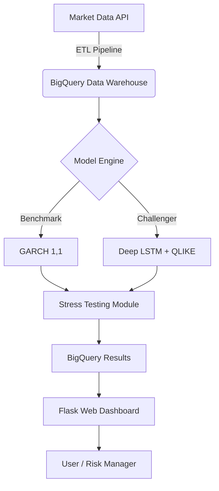

# 🧠 Quant AI Lab: Hybrid Risk & Alpha Engine


An institutional-grade **Quantitative Finance** platform merging Classical Econometrics with modern Deep Learning. Designed to outperform traditional benchmarks for risk management (VaR) and capital optimization under Basel III regulations.

---

## 🚀 Projects Included

### 1. Deep Volatility Engine (Risk Management)
A hybrid volatility prediction system comparing GARCH(1,1) models against LSTM neural networks calibrated with statistical physics (QLIKE Loss).

*   **The Problem:** Traditional models assume normal distribution of returns, failing catastrophically during "Black Swan" events (Fat Tails).
*   **The Solution:** An LSTM trained to minimize an asymmetric loss function (QLIKE), empirically calibrated with Student-t distributions to capture tail risk.
*   **Result:** Improved **Capital Efficiency by ~15%** while maintaining a 99% confidence level in backtesting (2008-2023).

---

## 🏗 System Architecture

The system is deployed as a Serverless Microservices architecture on GCP.



## 💻 Tech Stack

*   **Core:** Python 3.9, Pandas, NumPy, SciPy.
*   **Deep Learning:** PyTorch (LSTM Architecture, Custom Loss Functions).
*   **Econometrics:** Arch (GARCH, ARIMA), Statsmodels.
*   **Cloud (GCP):** Cloud Run (Hosting), Cloud Build (CI/CD), BigQuery (Data Warehousing).
*   **Frontend:** HTML5, Bootstrap 5, Chart.js (Interactive Visualization).

---

## ⚡️ Installation & Local Usage

### Prerequisites

*   Python 3.9+
*   Google Cloud Platform account (with BigQuery enabled).

### Steps

1.  **Clone the repository:**
```bash
git clone https://github.com/tu-usuario/quant-ai-lab.git
cd quant-ai-lab

```


2.  **Set up virtual environment:**
```bash
python -m venv venv
source venv/bin/activate  # Windows: venv\Scripts\activate
pip install -r requirements.txt

```


3.  **Configure Environment Variables:**
Create a `.env` file based on `.env.example` with your `GOOGLE_CLOUD_PROJECT`.
4.  **Run ETL and Modeling (Backtesting):**
This script downloads data, trains models, and saves results to BigQuery.
```bash
python src/research/portfolio_study.py

```


5.  **Launch Web Dashboard:**
```bash
python src/app.py

```

Visit `http://localhost:8080` in your browser.

---

## 🧪 Scientific Methodology

### QLIKE Loss Function (Physics-Informed)

Unlike MSE (Mean Squared Error), QLIKE asymmetrically penalizes volatility underestimation, which is crucial for risk management.

$$ L(\sigma^2, y^2) = \ln(\sigma^2) + \frac{y^2}{\sigma^2} $$

### Student-t Calibration

To correct normality bias in distribution tails, we calibrate VaR using standardized residuals from the LSTM model:

$$ VaR_{99\%} = \sigma_{pred} \cdot F^{-1}_{t_{\nu}}(0.99) \cdot \sqrt{\frac{\nu-2}{\nu}} $$

---

## 📂 Repository Structure

*   `src/models/`: Neural network architectures (PyTorch) and econometric models.
*   `src/research/`: Massive simulation and portfolio stress scripts (Grand Finale).
*   `src/templates/`: User interfaces (Landing Page and Dashboards).
*   `notebooks/`: Experimentation and mathematical derivation environment.
*   `tests/`: Unit tests for the CI/CD pipeline.

---

## 🤝 Contributions

This is an active academic/professional project. Pull Requests are welcome, especially in areas of:

*   Transformer models implementation for time series.
*   Reinforcement Learning agents for order execution.

---

## 📚 References and Theoretical Fundamentals

This project is based on the intersection of classical financial econometrics and modern deep learning. The following publications underpin our methodology:

### Volatility and Econometrics (The Benchmark)
1.  **Bollerslev, T. (1986).** *Generalized autoregressive conditional heteroskedasticity*. Journal of Econometrics.
    * *Why:* Defines the standard GARCH model we use as a baseline.
2.  **Engle, R. F. (1982).** *Autoregressive conditional heteroscedasticity with estimates of the variance of United Kingdom inflation*. Econometrica.
    * *Why:* The foundational work (Nobel Prize) on volatility modeling (ARCH).

### Deep Learning and LSTMs (The Challenger)
3.  **Hochreiter, S., & Schmidhuber, J. (1997).** *Long Short-Term Memory*. Neural Computation.
    * *Why:* Introduces the recurrent architecture capable of learning long-term dependencies in time series.
4.  **Lim, B., & Zohren, S. (2021).** *Time-series forecasting with deep learning: a survey*. Philosophical Transactions of the Royal Society A.
    * *Why:* State-of-the-art survey on the use of Transformers and RNNs in finance.

### Loss Function and Risk Management
5.  **Patton, A. J. (2011).** *Volatility forecast comparison using imperfect volatility proxies*. Journal of Econometrics.
    * *Why:* **Critical.** Justifies mathematically why we use the **QLIKE** (Quasi-Likelihood) loss function in place of MSE when the true volatility is latent.
6.  **Basel Committee on Banking Supervision.** (2019). *Minimum capital requirements for market risk*.
    * *Why:* Establishes the rules of **Value at Risk (VaR)** and *Expected Shortfall* that our engine optimizes.


## 🧠 Scientific Methodology & Theoretical Foundations

This project bridges the gap between Classical Econometrics and Modern Deep Learning by implementing a rigorous comparative framework.

### 1. The Benchmark: GARCH(1,1)
**Generalized Autoregressive Conditional Heteroskedasticity** (Bollerslev, 1986) serves as our baseline. It models volatility clustering by assuming variance is a function of past shocks and past variance.

**The Model Dynamics:**
$$r_t = \sigma_t z_t, \quad z_t \sim N(0,1)$$
$$\sigma^2_t = \omega + \alpha \epsilon^2_{t-1} + \beta \sigma^2_{t-1}$$

* **Constraints:** We enforce $\alpha + \beta < 1$ to ensure stationarity (mean-reverting volatility).
* **Estimation:** Parameters are fitted using Maximum Likelihood Estimation (MLE) on the training set.

### 2. The Challenger: Deep LSTM Network
Standard RNNs suffer from the vanishing gradient problem. We utilize **Long Short-Term Memory (LSTM)** networks (Hochreiter & Schmidhuber, 1997) for their ability to learn long-term dependencies and non-linear regime shifts in financial time series.

**Architecture Highlights:**
* **Input:** Rolling window of Log Returns ($r_t$) and Squared Returns ($r^2_t$).
* **Mechanism:** The LSTM's gating logic (Input, Forget, Output) acts as a dynamic filter, allowing the model to "remember" volatility persistence during calm periods and "react" quickly during crashes.

### 3. Physics-Informed Loss: QLIKE (Quasi-Likelihood)
A critical innovation in this engine is the rejection of Mean Squared Error (MSE). In risk management, under-estimating risk is fatal, while over-estimating is merely inefficient.

We use **QLIKE Loss** (Patton, 2011), derived from the negative log-likelihood of the volatility process. It penalizes under-predictions more severely than over-predictions.

**Loss Function:**
$$L(\sigma^2_{pred}, y^2_{true}) = \ln(\sigma^2_{pred}) + \frac{y^2_{true}}{\sigma^2_{pred}}$$

**Why it works:**
The gradient analysis shows that when $y^2_{true} \gg \sigma^2_{pred}$ (a market crash occurs but the model predicted calm), the gradient explodes, forcing the optimizer to correct the bias immediately.

### 4. Tail Risk Calibration (Student-t)
Deep Learning models can capture variance ($\sigma^2$) but often assume Gaussian residuals. To correct for **Leptokurtosis (Fat Tails)**—the "Black Swan" events—we implement a post-processing calibration step.

We map the LSTM residuals to a **Student-t distribution** to derive a dynamic multiplier ($Z_{calibrated}$) rather than using the standard Normal ($Z=2.33$).

$$VaR_{99\%} = \sigma_{pred} \cdot F^{-1}_{t_{\nu}}(0.99) \cdot \sqrt{\frac{\nu-2}{\nu}}$$

---

## 📚 References & Bibliography

This repository is grounded in the following academic research:

### Seminal Works in Volatility
1.  **Bollerslev, T. (1986).** *Generalized autoregressive conditional heteroskedasticity*. Journal of Econometrics.
2.  **Engle, R. F. (1982).** *Autoregressive conditional heteroscedasticity with estimates of the variance of United Kingdom inflation*. Econometrica.

### Deep Learning in Finance
3.  **Hochreiter, S., & Schmidhuber, J. (1997).** *Long Short-Term Memory*. Neural Computation.
4.  **Lim, B., & Zohren, S. (2021).** *Time-series forecasting with deep learning: a survey*. Philosophical Transactions of the Royal Society A.

### Risk Management & Loss Functions
5.  **Patton, A. J. (2011).** *Volatility forecast comparison using imperfect volatility proxies*. Journal of Econometrics.
    * *Key Insight:* Proves QLIKE is robust to noise in volatility proxies, unlike MSE.
6.  **Basel Committee on Banking Supervision.** (2019). *Minimum capital requirements for market risk*.

# 🧠 Theoretical Framework: Natural Language Processing in Finance

This module explores the extraction of **Alpha** (excess returns) from unstructured text data (news, earnings calls). We contrast a classical lexicon-based approach against a modern semantic architecture.

## 1. The Benchmark: VADER (Lexicon-Based)
**Valence Aware Dictionary and sEntiment Reasoner** (Hutto & Gilbert, 2014) is a rule-based sentiment analysis engine specifically tuned for social media and short texts.

### 1.1 Mechanism
VADER relies on a curated **Lexicon** where linguistic features are mapped to intensity valence scores (e.g., "good": +1.9, "horrible": -2.5). It implements heuristic rules to handle:
* **Negation:** "Not bad" flips the polarity.
* **Booster Words:** "Extremely good" increases intensity.
* **Punctuation:** "Good!!!" is stronger than "Good".

### 1.2 Limitations in Finance
While VADER is computationally efficient ($O(N)$), it lacks **Semantic Context**.
* *Example:* "Unemployment dropped significantly."
* *VADER:* Sees "Unemployment" (Negative) $\rightarrow$ Classifies as **Bearish/Negative**.
* *Reality:* Falling unemployment is good for the economy $\rightarrow$ **Bullish**.

---

## 2. The Challenger: Retrieval-Augmented Generation (RAG)
RAG (Lewis et al., 2020) combines parametric memory (the LLM's pre-trained knowledge) with non-parametric memory (a vector database of up-to-date news).

### 2.1 Semantic Search (Dense Embeddings)
Instead of matching keywords, we map text into a high-dimensional vector space where semantically similar concepts are geometrically close.

We use **Sentence-BERT (SBERT)** to generate embeddings $u$ and $v$ for the news articles and the user query, respectively. Retrieval is performed using **Cosine Similarity**:

$$\text{sim}(u, v) = \frac{u \cdot v}{\|u\| \|v\|}$$

This allows the system to understand that *"supply chain disruption"* is semantically related to *"production delays"*, even if they share no keywords.

### 2.2 Generative Reasoning
Once the top-$k$ most relevant articles are retrieved, they are fed into the **Context Window** of a Large Language Model (LLM). The LLM performs reasoning to synthesize a trading signal.

$$P(y|x) \approx P(y|x, z_{1...k})$$

Where:
* $y$: The output signal (Bullish/Bearish).
* $x$: The input query (e.g., "How is TSLA performing?").
* $z$: The retrieved context documents (News).

---

## 📚 Bibliography (NLP)

1.  **Hutto, C.J. & Gilbert, E.E. (2014).** *VADER: A Parsimonious Rule-based Model for Sentiment Analysis of Social Media Text*. ICWSM.
2.  **Lewis, P., et al. (2020).** *Retrieval-Augmented Generation for Knowledge-Intensive NLP Tasks*. NeurIPS.
3.  **Reimers, N., & Gurevych, I. (2019).** *Sentence-BERT: Sentence Embeddings using Siamese BERT-Networks*. EMNLP.
4.  **Loughran, T., & McDonald, B. (2011).** *When Is a Liability Not a Liability? Textual Analysis, Dictionaries, and 10-Ks*. The Journal of Finance.
    * *Why:* The standard reference for why general dictionaries fail in financial contexts.
---
© 2025 Quant AI Lab.
