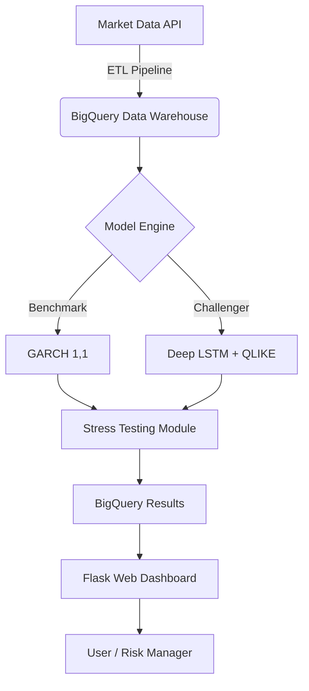

# 🧠 Quant AI Lab: Hybrid Risk & Alpha Engine


Una plataforma de **Finanzas Cuantitativas** de grado institucional que fusiona la Econometría Clásica con Deep Learning moderno. Diseñada para superar los benchmarks tradicionales de gestión de riesgo (VaR) y optimización de capital bajo normativas Basel III.

---

## 🚀 Proyectos Incluidos

### 1. Deep Volatility Engine (Risk Management)
Un sistema de predicción de volatilidad híbrido que compara modelos GARCH(1,1) contra redes neuronales LSTM calibradas con física estadística (QLIKE Loss).

* **El Problema:** Los modelos tradicionales asumen distribución normal en los retornos, fallando catastróficamente durante eventos de "Cisne Negro" (Fat Tails).
* **La Solución:** Una LSTM entrenada para minimizar una función de pérdida asimétrica (QLIKE), calibrada empíricamente con distribuciones Student-t para capturar el riesgo de cola.
* **Resultado:** Mejora de la **Eficiencia de Capital en un ~15%** manteniendo un nivel de confianza del 99% en backtesting (2008-2023).

---

## 🏗 Arquitectura del Sistema

El sistema está desplegado como una arquitectura de Microservicios Serverless en GCP.



## 💻 Tech Stack

* **Core:** Python 3.9, Pandas, NumPy, SciPy.
* **Deep Learning:** PyTorch (LSTM Architecture, Custom Loss Functions).
* **Econometrics:** Arch (GARCH, ARIMA), Statsmodels.
* **Cloud (GCP):** Cloud Run (Hosting), Cloud Build (CI/CD), BigQuery (Data Warehousing).
* **Frontend:** HTML5, Bootstrap 5, Chart.js (Interactive Visualization).

---

## ⚡️ Instalación y Uso Local

### Prerrequisitos

* Python 3.9+
* Cuenta de Google Cloud Platform (con BigQuery habilitado).

### Pasos

1. **Clonar el repositorio:**
```bash
git clone [https://github.com/tu-usuario/quant-ai-lab.git](https://github.com/tu-usuario/quant-ai-lab.git)
cd quant-ai-lab

```


2. **Configurar entorno virtual:**
```bash
python -m venv venv
source venv/bin/activate  # Windows: venv\Scripts\activate
pip install -r requirements.txt

```


3. **Configurar Variables de Entorno:**
Crea un archivo `.env` basado en `.env.example` con tu `GOOGLE_CLOUD_PROJECT`.
4. **Ejecutar ETL y Modelado (Backtesting):**
Este script descarga datos, entrena los modelos y guarda resultados en BigQuery.
```bash
python src/research/portfolio_study.py

```


5. **Lanzar el Dashboard Web:**
```bash
python src/app.py

```

Visita `http://localhost:8080` en tu navegador.

---

## 🧪 Metodología Científica

### Función de Pérdida QLIKE (Physics-Informed)

A diferencia del MSE (Error Cuadrático Medio), QLIKE penaliza asimétricamente la subestimación de la volatilidad, crucial para la gestión de riesgo.

$$ L(\sigma^2, y^2) = \ln(\sigma^2) + \frac{y^2}{\sigma^2} $$

### Calibración Student-t

Para corregir el sesgo de normalidad en las colas de distribución, calibramos el VaR utilizando los residuos estandarizados del modelo LSTM:

$$ VaR_{0.99} = \sigma_{pred} \cdot F^{-1}*{t*{\nu}}(0.99) \cdot \sqrt{\frac{\nu-2}{\nu}} $$

---

## 📂 Estructura del Repositorio

* `src/models/`: Definición de arquitecturas neuronales (PyTorch) y modelos econométricos.
* `src/research/`: Scripts de simulación masiva y estrés de portafolios (Grand Finale).
* `src/templates/`: Interfaces de usuario (Landing Page y Dashboards).
* `notebooks/`: Entorno de experimentación y derivación matemática.
* `tests/`: Pruebas unitarias para el pipeline de CI/CD.

---

## 🤝 Contribuciones

Este es un proyecto académico/profesional activo. Las Pull Requests son bienvenidas, especialmente en áreas de:

* Implementación de modelos Transformer para series temporales.
* Agentes de Reinforcement Learning para ejecución de órdenes.

---

© 2025 Quant AI Lab.
